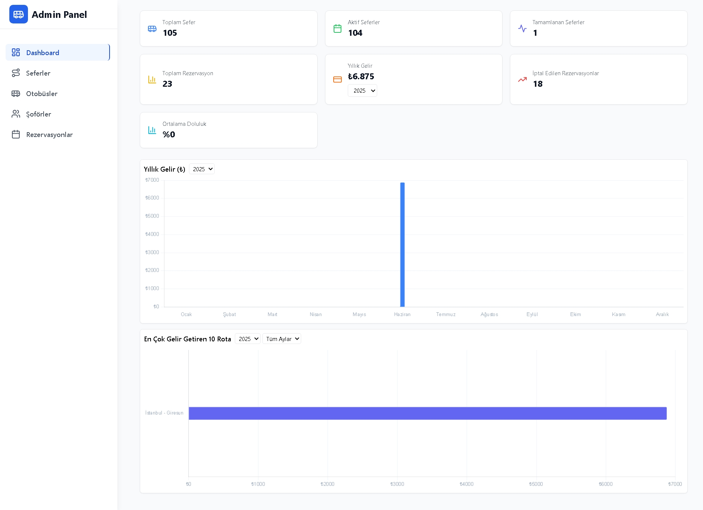
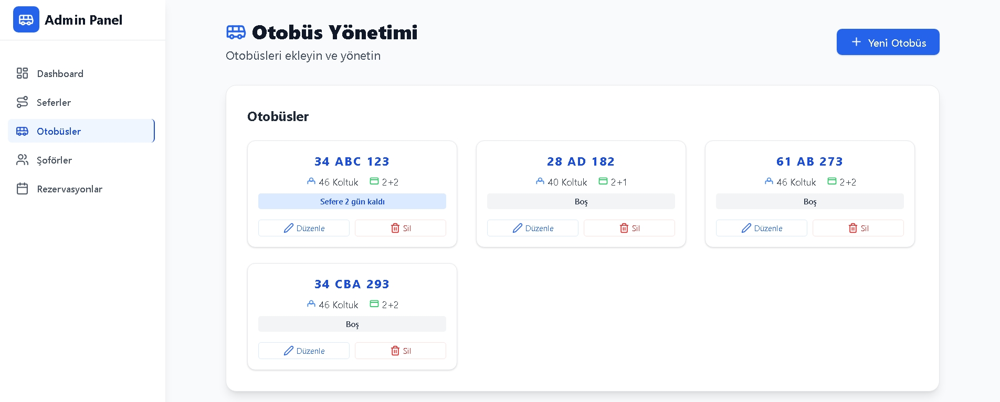
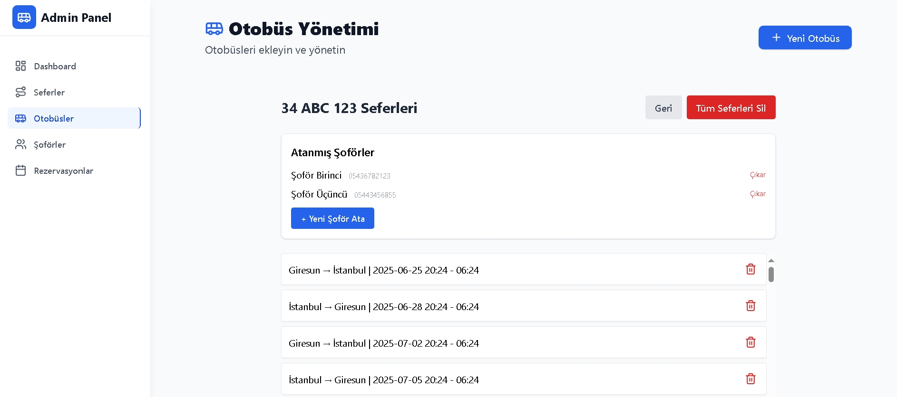
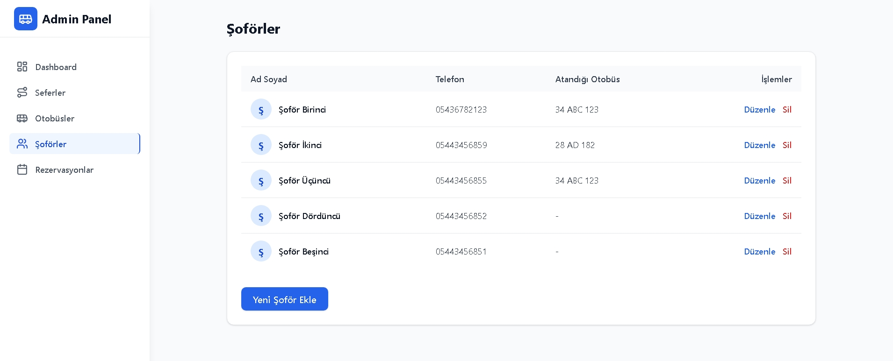
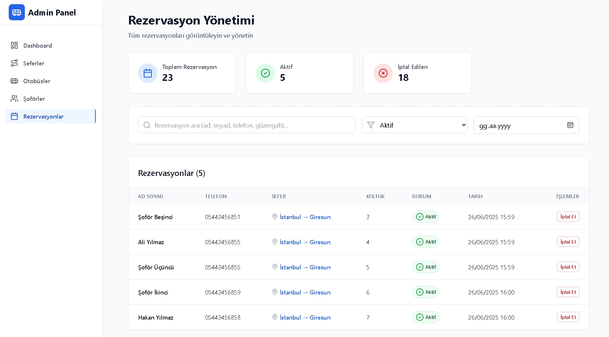
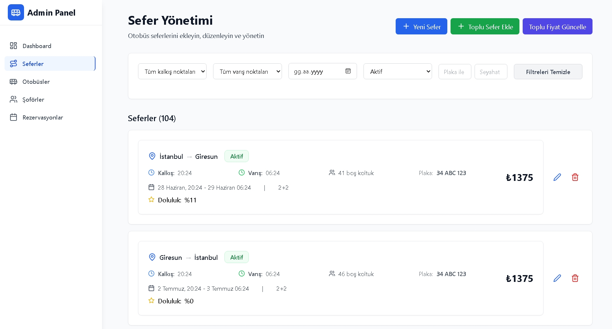
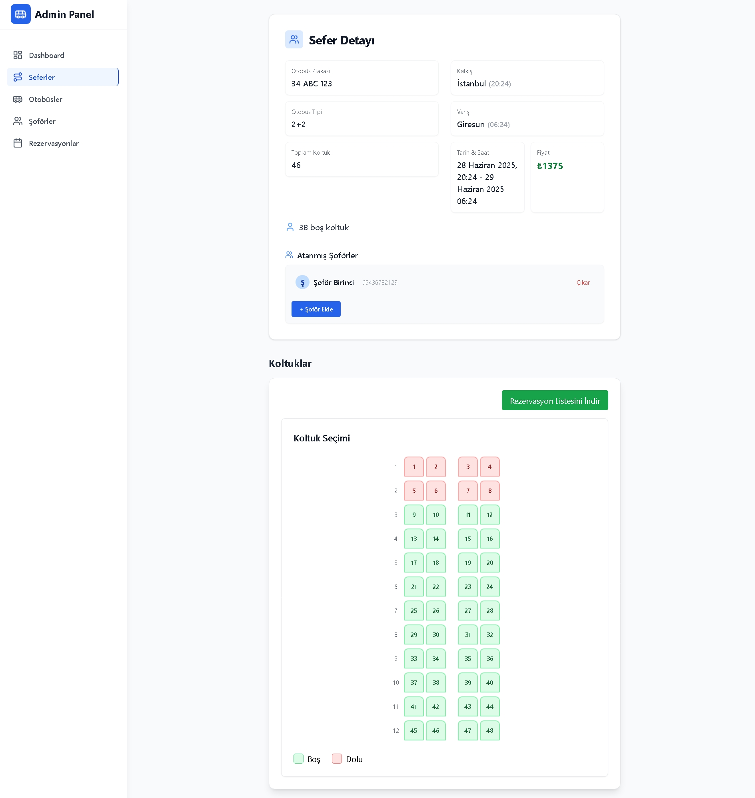
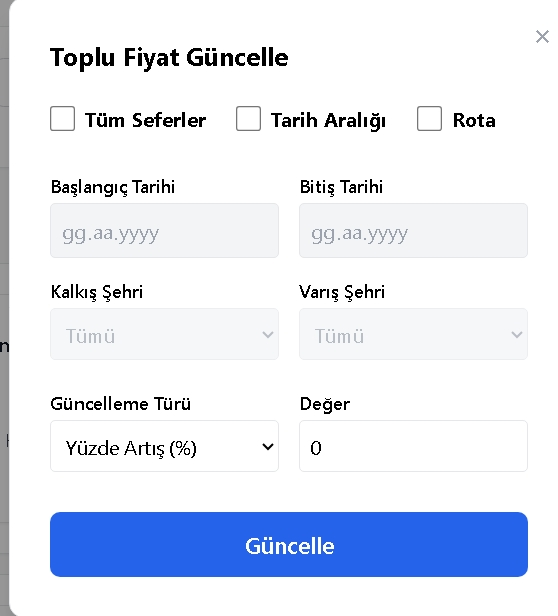

# Bus Reservation System

## Description

A modern, user-friendly bus ticket reservation and management system. Manage trips, buses, drivers, reservations, and revenue reports from a single panel.

## Installation

1. **Clone the project:**
   ```bash
   git clone <repo-url>
   cd Project
   ```
2. **Backend setup:**
   ```bash
   cd backend
   npm install
   npm start
   ```
3. **Frontend setup:**
   ```bash
   cd ../frontend
   npm install
   npm run dev
   ```
4. Create `.env` files for both backend and frontend (e.g., `VITE_API_URL` and Mongo connection).

## Usage

- Instantly view trips and seat status.
- Select seats and make quick reservations.
- Manage trips, buses, drivers, and reservations from the admin panel.
- Bulk price updates, get revenue reports.
- Easy to use with a modern and clean interface.

## Key Features

- Trip, bus, and driver management
- Seat map and real-time occupancy
- Create, edit, and cancel reservations
- Bulk price updates (percentage, fixed, by date/route)
- Revenue calculation
- Minimal and modern admin panel
- Turkish and user-friendly error/success messages

## Technologies

- **Frontend:** React, TypeScript, TailwindCSS, Vite
- **Backend:** Node.js, Express, TypeScript, MongoDB
- **Extras:** Axios, Lucide React, date-fns

## License

MIT

## Screenshots

Sample screenshots of the application can be found in the `screenshots` folder.









